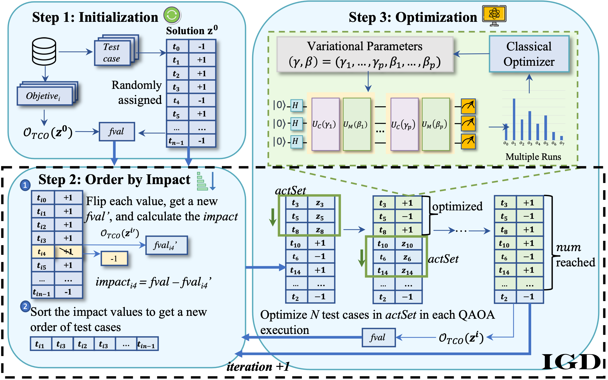

# LOCH-QAOA



This repository contains four industrial datasets and the code for producing results of running LOCH-QAOA and baseline approaches for TCO problems.

It also contains the original results reported in the paper and the analysing code.

## Structure of the repository

* Folder *Data* contains the information of 4 industrial datasets, including all the test cases and their attribute values.
* Folder *Code* contains the code of LOCH-QAOA, Div-QAOA, and two classical algorithms, random search and genetic algorithm.
* Folder *Analyse* contains the code of analysing the experiments and results.
* Zip file *Experiment Results* contains results of experiment in the paper.
    * subfolder *LOCH-QAOA-result*: each folder under it is named by qaoa_p (i.e., layers of QAOA). which contains results of 5 case studies stored in .zip files. 
      * The .zip files contain experiment results of all 10 runs of LOCH-QAOA with different sizes. In each run, we report results of each iteration, log information of each sub-problem and the final solution.
     * subfolder *Div-QAOA-result*: it contains experiment results of all 5 case studies. 
      * The subfolders under contain experiment results of all 10 runs. We report the information of each sub-problem and their optimal solution.
    * subfolder *GA-result*: it contains the experiment results of all 5 case studies, together with their optimal solutions in the .csv file.
      * The .zip files contain experiment results of each generation in all 10 runs.
    * subfolder *RandomSearch-results*: it contains the results of all 5 case studies.
      * The subfolders under contain experiment results of all 10 runs. We report the best recorded *fval* values eachieved in each iteration in that run.

## Installation of running the code
We use [Qiskit](https://qiskit.org/) as quantum framework. We use jMetalPy to implement the classical search algorithms (i.e., GA and RandomSearch)

The following steps should guarantee to have a working installation:
* Install Anaconda. You can download Anaconda for your OS from [https://www.anaconda.com/](https://www.anaconda.com/)
* Create an environment (e.g., with name "quantum_env")
    * conda create -n quantum_env python=3.9
* Activate the environment, and install qiskit, qiskit optimization, jMetalPy, docplex
    * conda activate quantum_env
    * pip install qiskit
    * pip install qiskit[optimization]
    
## Running our code

The approach can be run as follows.

First, you need to activate the conda environment:

```
conda activate quantum_env
```

In order to run LOCH-QAOA, you can run the following code:

```
python Code/loch-qaoa/loch_qaoa_tcm.py [run] [size] [p] [file name]
```

For example, the 1st run of our approach with QAOA sub-problem size 7 and 1 layer for dataset Paint Control:

```
python Code/loch-qaoa/loch_qaoa_tcm.py 1 7 1 paintcontrol
```

In order to run two case studies related to ELEVATOR, we can run the file loch_qaoa_elev_three.py and loch_qaoa_elev_two.py

To run DIV-QAOA, you can run the following code:

```
python Code/dev-qaoa/div_qaoa_tcm.py [run] [file name]
```
In order to run two case studies related to ELEVATOR, we can run the file loch_qaoa_elev_three.py and loch_qaoa_elev_two.py.

To run GA, you can run the following code:

```
python ga.py [n] [max_evaluation] [file name]
```
Specially, to run two case studies related to ELEVATOR, the "file name" is "elevator_two" and "elevator_three".

Similarly, you can run RS with

```
python rs.py [n] [max_evaluation] [file name]
```